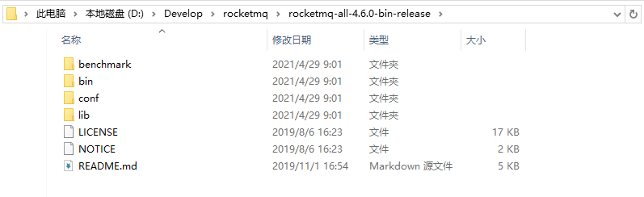
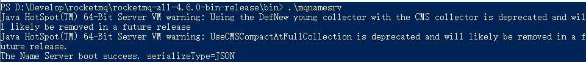
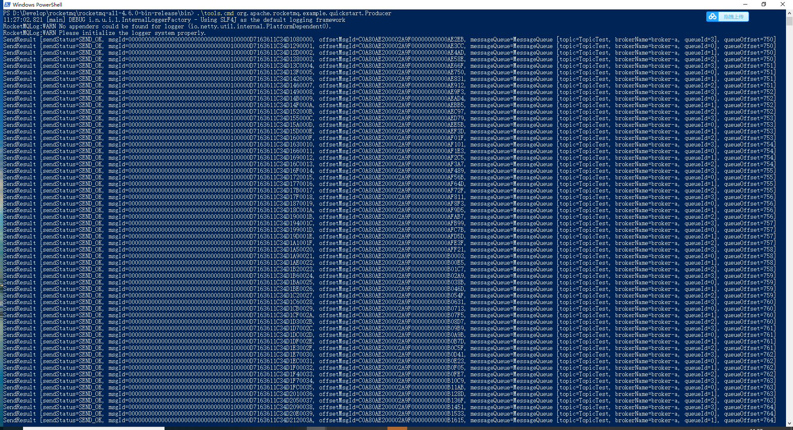
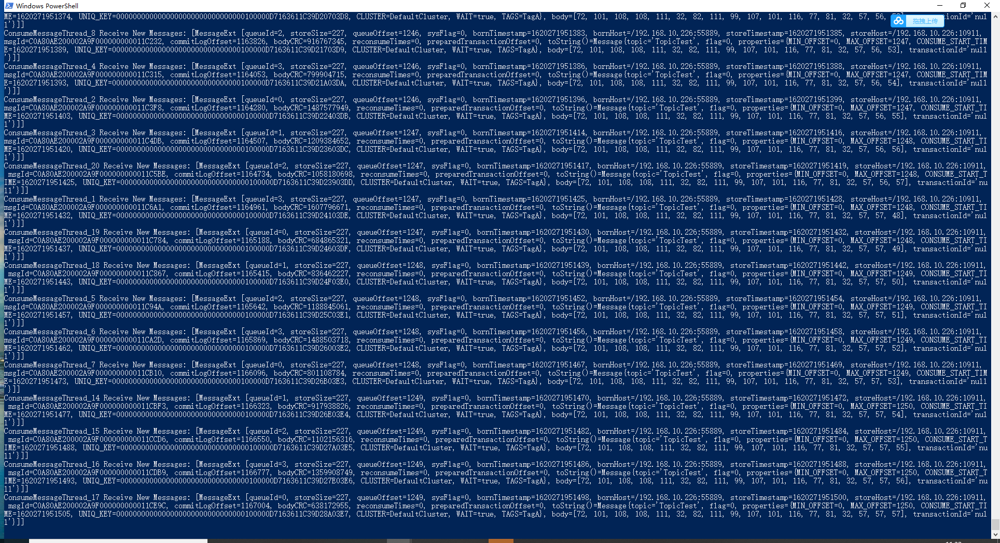
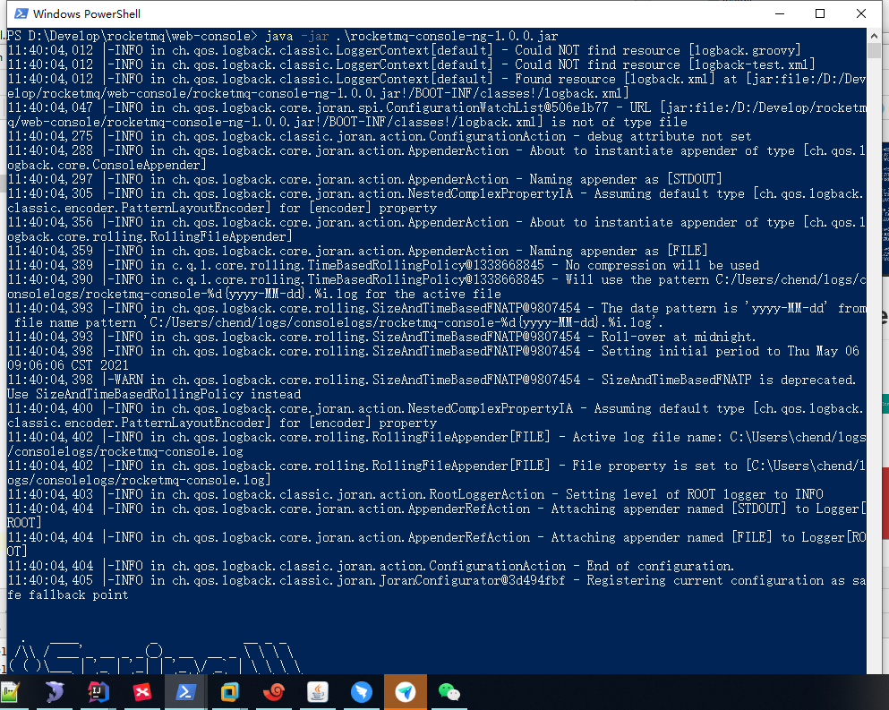
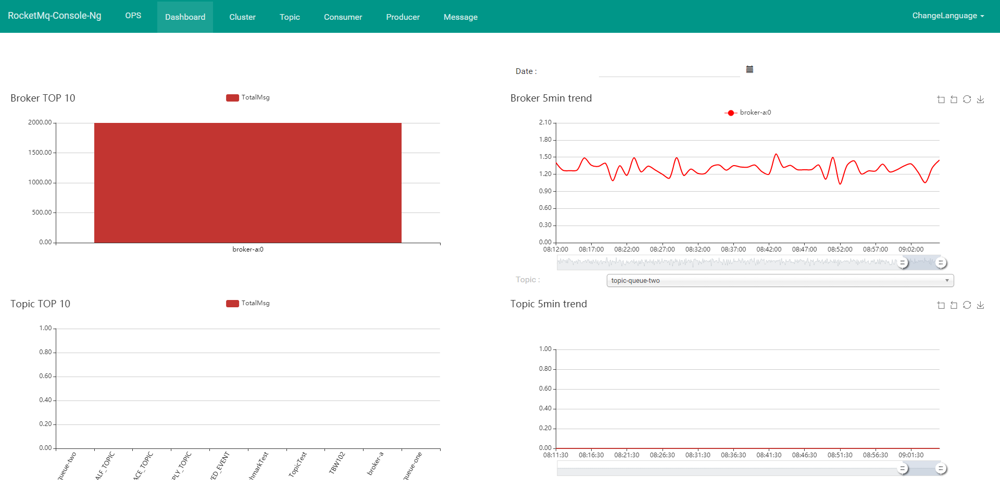
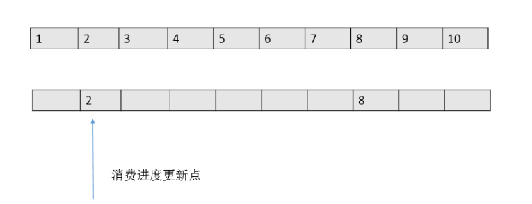

# RocketMQ的安装
下载rocketmq的压缩包:

[rocketmq安装包](./files/rocketmq-all-4.6.0-bin-release.zip)




## 启动NameServ


## 启动broker


## 测试生产者


## 测试消费者





## 使用web-console






------------------------------------------------------------------------------------------------------------------

# RocketMQ的原理

RocketMQ的三大组件：NameServer,Broker,FilterServer

## Name Server:
```text
1. Name Server是RokcetMQ的寻址服务。用于把Broker的路由信息做聚合。客户端依靠NameServer决定去获取对应topic的路由消息，
从而决定对哪些Broker做连接.

2. Name Server是无状态的节点，节点之间是采用share-nothing的设计方案，互相之间是不通信的。

3. 对于一个Name Server集群列表，客户端连接NameServer的时候，只会连接一个节点，做到负载均衡。

4. Name Server 所有状态都从Broker上报而来，本身不存储任何状态，所有的数据均在内存。

5. 所有Name Server节点全部挂了，影响到路由信息的更新，但是不会影响到Broker的通信。
```

## Broker
```text
Broker是存储消息和处理消息和转发消息的服务器。
1.Broker是以Group分开的，每个Group只允许一个master，若干个slave.

2. master才能进行数据写入，slave不允许 

3. 客户端可以从master和Slave消费，默认情况下，消费者都从master进行消费，如果master挂了，客户端会从slave消费。

4. Broker向所有的NameServer节点建立长连接，注册topic信息.
```


## Filter Server

```text
RocketMQ可以允许消费者上传一个Java类给Filter Server进行过滤。

1. Filter Server只能其在Broker所在的机器。

2. Filter Server可以有若干个。

3. 拉取消息的时候，消息先经过Filter Server ,Filter Server靠上传的Java类过滤消息后才推送给Consumer消费。

4. 客户端可以选择在消费的时候进行过滤，这样做可以更加充分的使用网卡的资源，

5. 避免使用分配过多的资源而导致服务器资源泄漏。

```

# 角色
* Producer
```text
生产者。发送消息的客户端角色。发送消息的时候需要指定Topic
```
* Consumer
```text
消费者。消费者的客户端角色。通常是后台的处理异步消费的系统。RocketMQ中Consumer有两种实现：PushConsumer和PullConsumer
```

* PushConsumer
```text
推送模式(虽然RocketMQ使用的是长轮询)的消费者。消息能及时的被消费。使用非常简单，内部已经处理如线程池，流控，负载均衡，
异常处理等等的各种场景。
```

* PullConsumer
```text
拉取模式的消费者。应用注意控制拉取的时机，怎么拉取，怎么消费等。主动权更加高。但是要自己处理各种场景。
```

## 概念术语

* Producer Group
```text
标识发送同一类的消息的Producer,通常发送逻辑一致。发送普通消息的时候，仅标识用，并无特别用处。
若事务消息，如果某条发送某条消息的Producer-A宕机，是的事务消息一直处于PREPARED状态的并超时，则broker
会回查同一个group的其他producer，确认这条消息应该commit还是rollback。但是开源版本并不完全支持事务消息。

```

* Consumer Group
```text
标识一类Consumer的集合名称，这类Consumer通常消费一类消息，且消费逻辑一直，同一个Consumer Group 下的各个实例江
共同消费topic的消息，期道负载均衡的作用。
消费进度以Consumer Group为粒度管理，不同的Consumer Group之间消费进度彼此不受影响，及时消息A被Consumer Group1
消费过，也会再给Consumer Group2消费。
注： RocketMQ要求同一个Consumer Group的消费者必须要拥有相同的注册信息，即必须要要一样的topic(并且tag也一样)
```

* Topic
```text
标识一类消息的逻辑名字，消息的逻辑管理单位。五路消息生产还是消费，都需要指定Topic.
```

* Tag
```text
RocketMQ支持在发送时候给topic打tag，同一个topic的消息虽然逻辑管理是一样的，但是消费topic1的时候，如果你订阅的时候指定的是
tagA,那么tagB的消息不会投递。
```

* Message Queue
```text
Queue是消息的物理管理单位。一个Topic将又若干个Queue.若Topic同事创建在不同的Broker，则不同的broker上都有若干
Queue,消息将物理地存储落在不同的broker节点上，具有水平扩展的能力。
无论是生产者还是消费者，实际的生产和消费都是针对Q级别的。例如Producer发送消息的时候，也会玉箫的选择(默认轮询)
```

* Offset
```text
RocketMQ中，有很多offset的概念。但通常我们只关心暴露到客户端的offset.一般我们不特指的话，就是Message Queue下面的offset.
可以认为一条逻辑的message queue是无限长的数组。一条消息进来下标就会+1.下标就是offset.

一条message queue中的max offset表示消息的最大offset.注：这里从源码上看，max_offset并不是最新的那条消息的offset,而是表示最新的
offset.而min offset则标识现在的最小offset。

由于消息存储一段时间后，消息会被物理的从磁盘删除，messsage queue和min offset也就对应增长。这以为这比min offset要小的哪些消息已
经不在broker上了，无法被消费了。
```


* Consumer Offset
```text
用于标记Consumer Group 在一条逻辑Message Queue上，消息消费到哪里了。
注意：这个数值最新消费的那条消息的offset+1,所以实际上这个值存储的是[下次拉取的话，从哪里开始拉取得offset]

消费者拉取消息的时候需要指定offset，broker不主动推送消息，而是接受到请求的时候把存储的对应offset的消息返回给客户端。
这个offset在成功消费后会更新到内存，并定时持久化。在集群消费模式下，会同步持久化到broker。在广播模式下，会持久化到本地文件。

实例重启的时候会获取持久化的consumer offset，用以决定从哪里开始消费。
```

* 集群消费
```text
消费者的一种消费模式。一个Consumer Group中的各个Consumer实例分摊去消费消息，即一条消息只会投递到一个Consumer Group下面的一个实例。

实际上，每个Consumer是平均分摊Message Queue的去做拉取消费。例如某个Topic有3条Q，其中一个Consumer Group 有 3 个实例
（可能是 3 个进程，或者 3 台机器），那么每个实例只消费其中的1条Q。

而由Producer发送消息的时候是轮询所有的Q,所以消息会平均散落在不同的Q上，可以认为Q上的消息是平均的。那么实例也就平均地消费消息了。

这种模式下，消费进度的存储会持久化到Broker。
```

* 广播消费
```text
消费者的一种消费模式。消息将对一个Consumer Group下的各个Consumer实例都投递一遍。即即使这些 Consumer 属于同一个Consumer Group，
消息也会被Consumer Group 中的每个Consumer都消费一次。

实际上，是一个消费组下的每个消费者实例都获取到了topic下面的每个Message Queue去拉取消费。所以消息会投递到每个消费者实例。

这种模式下，消费进度会存储持久化到实例本地。
```

* 顺序消息
```text
消费消息的顺序要同发送消息的顺序一致。由于Consumer消费消息的时候是针对Message Queue顺序拉取并开始消费，且一条Message Queue只会
给一个消费者（集群模式下），所以能够保证同一个消费者实例对于Q上消息的消费是顺序地开始消费（不一定顺序消费完成，因为消费可能并行）。

在RocketMQ中，顺序消费主要指的是都是Queue级别的局部顺序。这一类消息为满足顺序性，必须Producer单线程顺序发送，且发送到同一个队列，
这样Consumer就可以按照Producer发送的顺序去消费消息。

生产者发送的时候可以用MessageQueueSelector为某一批消息（通常是有相同的唯一标示id）选择同一个Queue，则这一批消息的消费将是顺序消息
（并由同一个consumer完成消息）。或者Message Queue的数量只有1，但这样消费的实例只能有一个，多出来的实例都会空跑。
```

* 普通顺序消息
```text
顺序消息的一种，正常情况下可以保证完全的顺序消息，但是一旦发生异常，Broker宕机或重启，由于队列总数发生发化，消费者会触发负载均衡，
而默认地负载均衡算法采取哈希取模平均，这样负载均衡分配到定位的队列会发化，使得队列可能分配到别的实例上，则会短暂地出现消息顺序不一致。

如果业务能容忍在集群异常情况（如某个 Broker 宕机或者重启）下，消息短暂的乱序，使用普通顺序方式比较合适。
```

* 严格顺序消息
```text
顺序消息的一种，无论正常异常情况都能保证顺序，但是牺牲了分布式 Failover 特性，即 Broker集群中只要有一台机器不可用，
则整个集群都不可用，服务可用性大大降低。

如果服务器部署为同步双写模式，此缺陷可通过备机自动切换为主避免，不过仍然会存在几分钟的服务不可用。
（依赖同步双写，主备自动切换，自动切换功能目前并未实现）
```


## Rocket水平扩展及负载均衡

* Broker负载均衡
```text
Broker是以Group为单位提高服务。一个group里面分为master和slave,master和slave存储数据一样，slave从master同步数据(
同步双写或者异步复制配置)

通过nameserver暴露给客户端后，只是客户端关心（注册或发送）一个个的topic路由信息。路由信息中会细化为message queue的路由信息。
而message queue会分布在不同的broker group.所以对于客户端来说，分布在不同的broker group的message queue成为一个服务集群，
但是客户端会把请求分摊到不同的queue。

而由于压力分摊到了不同的queue，不同的queue实际上分布在不同的Broker group，也就是说压力会分摊到不同的broker group，也就是说压力会
分摊到不同的broker进程，这样消息的存储和转发均起到负载均衡的作用。

Broker一旦需要横向扩展，只需要增加broker group,然后把对于的topic建上，客户端的message queue集合即会变大，这样对于broker的负载则
由更多的broker group来进行分担。

```

*commit log
```text
虽然每个topic下面由很多message queue,但是message queue本身并不存储消息，真正的消息存储会卸载CommitLog的文件，message queue只
是存储CommitLog中对于的位置信息，方便通过message queue找到对应存储在CommitLog的消息。

不同的topic，message queue都是写到相同的CommitLog文件，也就是说CommitLog完全的顺序写。

```

## 消息ACK机制以及小佛二进度管理
```text
PushConsumer为了保证消息肯定消费成功，只有使用方明确标识消费成功，RocketMQ才会认为消息消费成功。中途断电，抛出异常等都
不会认为成功---即都会重新投递。在消费的时候我们需要注入一个消费回调：
consumer.registerMessageListener(new MessageListenerConcurrently(){
@Override
public ConsumerrentlyStatue consumeMessage(List<MessageExt> msgs,ConsumerConccurrentlyContext context){
System.out.println(Thread.currentThread().getName()+"Receive New Messages:"+msgs);
dosomething();
return ConsumeConcurrentlyStatus.CONSUME_SUCCESS;
}
});
业务实现消费回调的时候，当且仅当此回调函数返回ConsumeConcurrentlyStatus.CONSUME_SUCCESS,RocketMQ才会认为
这批消息(默认是1条)是消费完成的.

消费失败就会返回ConsumeConcurrentlyStatus.RECONSUME_LATER,RocketMQ就会认为这批消息消费失败了。

为了保证消息肯定背至少消费成功一次，RocketMQ会把这批消息重发回Broker(topic不是原topic而是这个消费组的RETRY topic)，在延迟
的某个时间点(默认10秒，业务可设置)后。再次投递道这个ConsumerGroup。而如果一直这样重复消费都持续失败到一定次数(默认16次)，
就会投递到DLQ死信队列。应用可以监控死信队列来做人工干预。

注意：
1. 如果业务的回调没有处理好而抛出异常，会认为是消费时报当ConsumeConcurrentlyStatus.RECONSUME_LATER处理。

2. 当使用顺序消费的回调MessageListerOrderly时，由于顺序消费时要前者消费成功才能继续消费，所以没有RECONSUME_LATER的这个状态，只有
SUSPEND_CURRNET_QUEUE_A_MOMENT来暂停队列的其余消费，知道原来消息不断充实成功为止才能继续消费。
```

* 启动是时候获取消费的位置
```text
当新实例启动的时候，PushConsumer会拿到本消费组的broker已经记录好的消费进度(consumer offset)，按照这个进度发起自己的第一次Pull请求
如果这个消费进度在Broker并没有存储起来，证明这个是一个全新的消费组，这个时候客户端有几个策略可以选择
// 默认策略，从该队列最尾开始消费，即跳过历史消息
1. CONSUMER_FROM_LAST_OFFSET
// 从队列最开始开始消费，即历史消息(还存储在broker)全部消费一遍
2. CONSUMER_FROM_FIRST_OFFSET
//从某个时间点开始消费，和setConsumeTimestamp()配置使用，默认是半个小时以前的
3. CONSUMER_FROM_TIMESTAMP
```

* 消息ACK机制
```text
RocketMQ是以consumer group+queue为单位管理消费进度的，以一个consumer offset标记这个消费组在这个queue消费进度。
如果某已存在的消费组出现了新消费实例的时候，依靠这个组的消费进度，就可以判断第一次是从哪里开始拉取的。
每次消息成功后，本地的消费进度会被更新，然后由定时器定时同步到broker，以此持久化消费进度。
但是每次记录消费进度的时候，只会把一批消息中最小的offset值作为消费进度值，如下图：
```

```text
这种方式和传统的一条message单独ack的方式有本质的区别。性能上有了很大的提升，但是也存在一个重复问题---由于消费进度只是记录了一个下标
，就可能出现拉取了100条消息如 2101-2200的消息，后面99条都消费结束了，只有2101消费一直没有结束的情况。                                                 
在这种情况下，RocketMQ为了保证消息肯定被消费成功，消费进度职能维持在2101，直到2101也消费结束了，本地的消费进度才会一下子更新到2200。

在这种设计下，就有消费大量重复的风险。如2101在还没有消费完成的时候消费实例突然退出（机器断电，或者被kill）。这条queue的消费进度还
是维持在2101，当queue重新分配给新的实例的时候，新的实例从broker上拿到的消费进度还是维持在2101，这时候就会又从2101开始消费，
2102-2200这批消息实际上已经被消费过还是会投递一次。
对于这个场景，3.2.6之前的RocketMQ无能为力，所以业务必须要保证消息消费的幂等性，这也是RocketMQ官方多次强调的态度。

实际上，从源码的角度上看，RocketMQ可能是考虑过这个问题的，截止到3.2.6的版本的源码中，可以看到为了缓解这个问题的影响面，
DefaultMQPushConsumer中有个配置consumeConcurrentlyMaxSpan
/**
 * Concurrently max span offset.it has no effect on sequential consumption
 */
private int consumeConcurrentlyMaxSpan = 2000;

这个值默认是2000，当RocketMQ发现本地缓存的消息的最大值-最小值差距大于这个值（2000）的时候，会触发流控——也就是说如果头尾都卡住了
部分消息，达到了这个阈值就不再拉取消息。

但作用实际很有限，像刚刚这个例子，2101的消费是死循环，其他消费非常正常的话，是无能为力的。一旦退出，在不人工干预的情况下，2101后
所有消息全部重复。


```


# RocketMQ的使用